# Tutorial: Configure Recnice for automatic user provisioning

The objective of this tutorial is to demonstrate the steps to be performed in Recnice and Azure Active Directory (Azure AD) to configure Azure AD to automatically provision and de-provision users and/or groups to Recnice.

> [!NOTE]
> This tutorial describes a connector built on top of the Azure AD User Provisioning Service. For important details on what this service does, how it works, and frequently asked questions, see [Automate user provisioning and deprovisioning to SaaS applications with Azure Active Directory](../app-provisioning/user-provisioning.md).
>
> This connector is currently in Public Preview. For more information on the general Microsoft Azure terms of use for Preview features, see [Supplemental Terms of Use for Microsoft Azure Previews](https://azure.microsoft.com/support/legal/preview-supplemental-terms/).

## Prerequisites

The scenario outlined in this tutorial assumes that you already have the following prerequisites:

* An Azure AD tenant.
* [A Recnice tenant](https://www.recnice.com/pricing/).
* A user account in Recnice with Admin permissions.

## Step 1. Plan your provisioning deployment
1. Learn about [how the provisioning service works](../app-provisioning/user-provisioning.md).
2. Determine who will be in [scope for provisioning](../app-provisioning/define-conditional-rules-for-provisioning-user-accounts.md).
3. Determine what data to [map between Azure AD and Recnice](../app-provisioning/customize-application-attributes.md). 

## Assigning users to Recnice

Azure Active Directory uses a concept called *assignments* to determine which users should receive access to selected apps. In the context of automatic user provisioning, only the users and/or groups that have been assigned to an application in Azure AD are synchronized.

Before configuring and enabling automatic user provisioning, you should decide which users and/or groups in Azure AD need access to Recnice. Once decided, you can assign these users and/or groups to Recnice by following the instructions here:
* [Assign a user or group to an enterprise app](../manage-apps/assign-user-or-group-access-portal.md)

## Important tips for assigning users to Recnice

* It is recommended that a single Azure AD user is assigned to Recnice to test the automatic user provisioning configuration. More users and/or groups may be assigned later.

* When assigning a user or a group to Recnice, you must select any valid application-specific role in the assignment dialog.

|Role name|Description
|---|---|
|Recognition User|Common user|
|Recognition Company Admin|Company Admin|
|Recognition Company CoAdmin|Company Admin with read-only access|

* Users with the **Default Access** role are excluded from provisioning.

## Step 2. Configure Recnice to support provisioning with Azure AD

Before configuring Recnice for automatic user provisioning with Azure AD, you will need to enable SCIM provisioning on Recnice.

1. Sign in to your Recnice Admin Console. Click on **Settings**.

	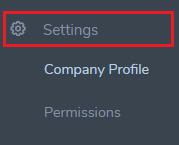

2. Click on **Company Profile**.

	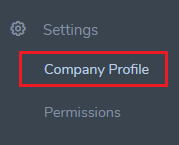

3. Copy the **SCIM Key** value. This value will be entered in the **Secret Token** field in the Provisioning tab of your Recnice application in the Azure portal.

	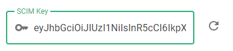

## Step 3. Add Recnice from the gallery

To configure Recnice for automatic user provisioning with Azure AD, you need to add Recnice from the Azure AD application gallery to your list of managed SaaS applications.

**To add Recnice from the Azure AD application gallery, perform the following steps:**

1. In the **[Azure portal](https://portal.azure.com)**, in the left navigation panel, select **Azure Active Directory**.

	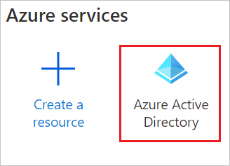

2. Go to **Enterprise applications**, and then select **All applications**.

	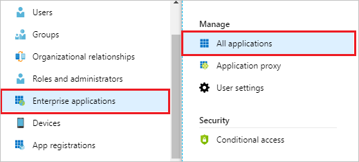

3. To add a new application, select the **New application** button at the top of the pane.

	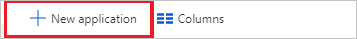

4. In the search box, enter **Recnice**, select **Recnice** in the results panel, and then click the **Add** button to add the application.

	

## Step 4. Configure automatic user provisioning to Recnice 

This section guides you through the steps to configure the Azure AD provisioning service to create, update, and disable users and/or groups in Recnice based on user and/or group assignments in Azure AD.

### To configure automatic user provisioning for Recnice in Azure AD:

1. Sign in to the [Azure portal](https://portal.azure.com). Select **Enterprise Applications**, then select **All applications**.

	

2. In the applications list, select **Recnice**.

	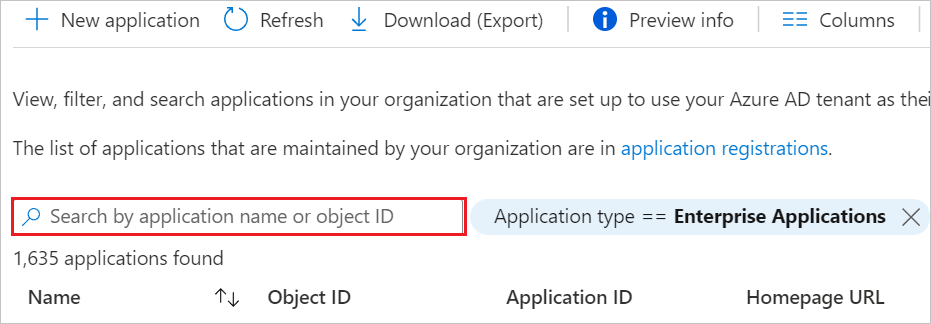

3. Select the **Provisioning** tab.

	

4. Set the **Provisioning Mode** to **Automatic**.

	

5. Under the **Admin Credentials** section, input `https://scim.recnice.com/scim` in **Tenant URL**. Input the **SCIM Key** value retrieved earlier in **Secret Token**. Click **Test Connection** to ensure Azure AD can connect to Recnice. If the connection fails, ensure your Recnice account has Admin permissions and try again.

	

6. In the **Notification Email** field, enter the email address of a person or group who should receive the provisioning error notifications and check the checkbox - **Send an email notification when a failure occurs**.

	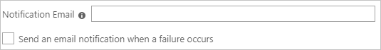

7. Click **Save**.

8. Under the **Mappings** section, select **Provision Azure Active Directory Users**.

	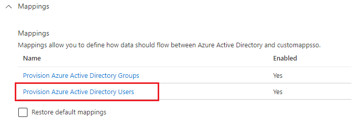

9. Review the user attributes that are synchronized from Azure AD to Recnice in the **Attribute Mapping** section. The attributes selected as **Matching** properties are used to match the user accounts in Recnice for update operations. Select the **Save** button to commit any changes.

   |Attribute|Type|Supported for filtering
   |---|---|---|
   |userName|String|&check;|
   |active|Boolean|
   |displayName|String|
   |title|String|
   |emails[type eq "work"].value|String|
   |preferredLanguage|String|
   |name.givenName|String|
   |name.familyName|String|
   |name.formatted|String|
   |addresses[type eq "work"].formatted|String|
   |addresses[type eq "work"].streetAddress|String|
   |addresses[type eq "work"].locality|String|
   |addresses[type eq "work"].region|String|
   |addresses[type eq "work"].postalCode|String|
   |addresses[type eq "work"].country|String|
   |externalId|String|
   |urn:ietf:params:scim:schemas:extension:enterprise:2.0:User:department|String|
   |roles|Expression|

   > [!NOTE]
   > Use the AppRoleAssignmentsComplex expression to provision ***roles*** attribute:
   > * Select the **Show advanced options** check box at the bottom of the Attribute Mapping screen, and then select **Edit attribute list for your app**.
   > * Add *roles* attribute and click **Save**.
	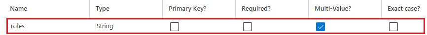
   > * Then use the *AppRoleAssignmentsComplex([appRoleAssignments])* expression to map to the custom *roles* attribute as shown in the image below.
    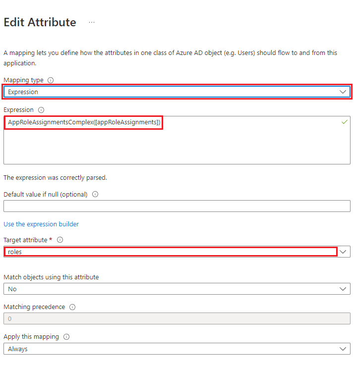
   
10. Under the **Mappings** section, select **Provision Azure Active Directory Groups**.

	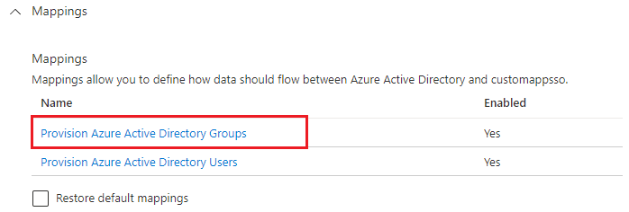

11. Review the group attributes that are synchronized from Azure AD to Recnice in the **Attribute Mapping** section. The attributes selected as **Matching** properties are used to match the groups in Recnice for update operations. Select the **Save** button to commit any changes.

      |Attribute|Type|Supported for filtering|
      |---|---|---|
      |displayName|String|&check;|
      |members|Reference|
      |externalId|String|      

12. To configure scoping filters, refer to the following instructions provided in the [Scoping filter tutorial](../app-provisioning/define-conditional-rules-for-provisioning-user-accounts.md).

13. To enable the Azure AD provisioning service for Recnice, change the **Provisioning Status** to **On** in the **Settings** section.

	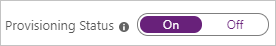

14. Define the users and/or groups that you would like to provision to Recnice by choosing the desired values in **Scope** in the **Settings** section.

	

15. When you are ready to provision, click **Save**.

	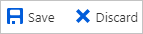

	This operation starts the initial synchronization of all users and/or groups defined in **Scope** in the **Settings** section. The initial sync takes longer to perform than subsequent syncs, which occur approximately every 40 minutes as long as the Azure AD provisioning service is running. You can use the **Synchronization Details** section to monitor progress and follow links to provisioning activity report, which describes all actions performed by the Azure AD provisioning service on Recnice.

## Step 5. Monitor your deployment
Once you've configured provisioning, use the following resources to monitor your deployment:

* Use the [provisioning logs](../reports-monitoring/concept-provisioning-logs.md) to determine which users have been provisioned successfully or unsuccessfully
* Check the [progress bar](../app-provisioning/application-provisioning-when-will-provisioning-finish-specific-user.md) to see the status of the provisioning cycle and how close it is to completion
* If the provisioning configuration seems to be in an unhealthy state, the application will go into quarantine. Learn more about quarantine states [here](../app-provisioning/application-provisioning-quarantine-status.md).

## Additional resources

* [Managing user account provisioning for Enterprise Apps](../app-provisioning/configure-automatic-user-provisioning-portal.md)
* [What is application access and single sign-on with Azure Active Directory?](../manage-apps/what-is-single-sign-on.md)

## Next steps

* [Learn how to review logs and get reports on provisioning activity](../app-provisioning/check-status-user-account-provisioning.md)
